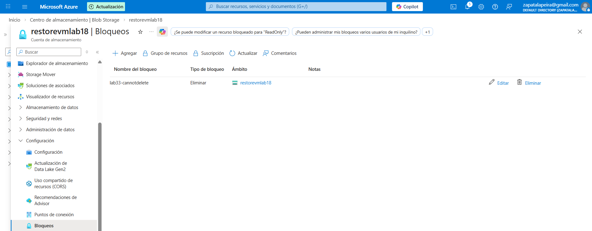
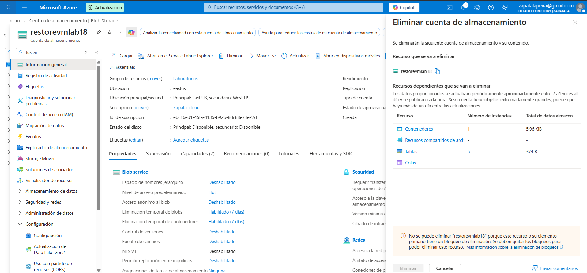

# Lab 33 - Resource Lock para evitar borrados accidentales

En este laboratorio he aplicado un lock de tipo `CanNotDelete` sobre un recurso de Azure para protegerlo frente a borrados accidentales.

Es una medida sencilla, pero bastante útil. Aunque una persona tenga permisos sobre el recurso, el lock añade una capa extra de protección y evita que se elimine por error. Me parece especialmente interesante para recursos importantes o para entornos donde varias personas pueden estar trabajando sobre lo mismo.

## Qué he hecho

He añadido un bloqueo de tipo `CanNotDelete` a un recurso y después he intentado eliminarlo para comprobar que Azure impide el borrado mientras ese lock esté aplicado.

## Capturas

### Lock creado

### Intento de borrado bloqueado

## Nombre de los archivos

`images/01-lock-created.png`  
`images/02-delete-blocked.png`

## Qué se ve en la evidencia

En la primera captura se ve el lock ya creado sobre el recurso.  
En la segunda se ve que Azure bloquea el intento de borrado precisamente por ese bloqueo.

## Cómo lo explicaría en una entrevista

Yo lo explicaría como una medida básica de gobierno y protección. No sustituye a una buena gestión de permisos, pero sí añade una capa muy útil para evitar errores humanos. Me parece especialmente práctico en recursos sensibles o en entornos donde quieres reducir el riesgo de borrado accidental aunque alguien tenga permisos de administración o Contributor.
